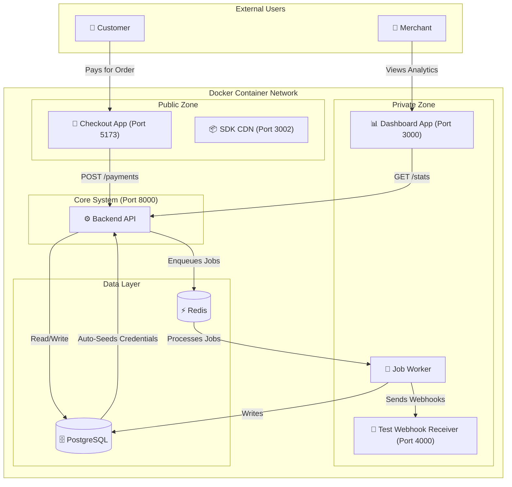
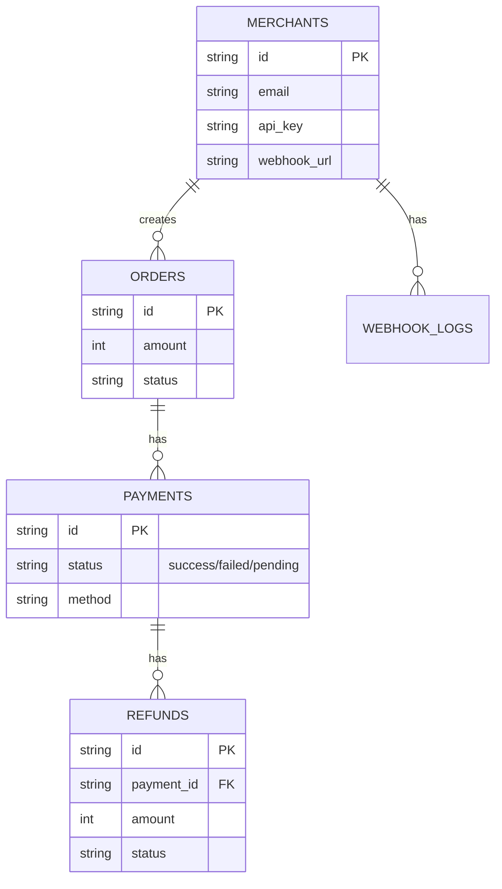

# 💳 Payment Gateway Simulator

A production-ready, containerized Payment Gateway Simulator built for the Capstone Project. This system simulates a real-world payment ecosystem, including a Merchant Dashboard, a Customer Checkout Page, a robust Backend API with automated failure testing ("Magic Triggers"), and a dedicated **Test Merchant Webhook Receiver**.

---

## 🚀 Features

- **Full-Stack Simulation:** Complete flow from Order Creation → Checkout → Payment Processing → Merchant Analytics.
- **Dockerized Environment:** Entire stack (Frontend, Backend, Database, Redis, Webhook Receiver) spins up with a single command.
- **Asynchronous Processing:** Uses Redis & BullMQ for reliable background job processing (Payments, Refunds, Webhooks).
- **Merchant Dashboard:** Real-time transaction history, success rate analytics, webhook logs, and credential management.
- **Universal Checkout:** Supports both Card (Luhn validation, Network detection) and UPI payment methods.
- **Webhook System:** Robust event notification system with exponential backoff retries and "Test Merchant" auto-verification.
- **Simulation Engine:** Deterministic testing using specific inputs to force Success, Failure, or Pending states.

---

## 🏗️ Architecture

The system follows a microservices-style architecture orchestrated via Docker Compose.



---

## 🛠️ Tech Stack

**Backend:** Node.js, Express.js
**Database:** PostgreSQL 15 (Alpine)
**Queue:** Redis, Bull (for Async Jobs)
**Frontend (Dashboard):** React.js, Tailwind CSS, Recharts
**Frontend (Checkout):** React.js, Axios
**Infrastructure:** Docker, Docker Compose
**Testing:** Jest (Logic), Postman (API)

---

## ⚙️ Setup & Installation

### Prerequisites

Ensure **Docker Desktop** is installed and running on your machine.

### 1. Clone the Repository

```bash
git clone <your-repo-url>
cd payment-gateway
```

### 2. Configure Environment

Copy the example configuration file. The default values are already optimized for the Docker environment.

```bash
cp .env.example .env
```

### 3. Start the Application

Run the following command to build and start all services (API, Database, Redis, Worker, Frontends, and Test Receiver).

```bash
docker-compose up -d --build
```

Wait ~15-30 seconds for all containers to initialize. The database will automatically seed a "Test Merchant" account.

---

## 🌐 Access the Services

| Service | URL | Credentials |
| :--- | :--- | :--- |
| **🛍️ Checkout Page** | [http://localhost:5173](http://localhost:5173) | No login required |
| **📊 Merchant Dashboard** | [http://localhost:3000](http://localhost:3000) | **Email:** `test@example.com` <br> **Pass:** Any password |
| 🔌 Backend API        | [http://localhost:8000](http://localhost:8000) | `x-api-key: key_test_abc123`             |
| 📡 Test Webhook Receiver | Internal Docker Service | Accessible via `http://localhost:4000` (Locally) |
| 📦 CDN (SDK)          | [http://localhost:3002/checkout.js](http://localhost:3002/checkout.js) | Embeddable Script |

---

## 🔌 How to use the Embeddable SDK

You can embed the payment modal in any website using the following script:

```html
<script src="http://localhost:3002/checkout.js"></script>
<script>
  const gateway = new window.PaymentGateway({
    key: 'key_test_abc123',
    orderId: 'order_123...', // Generated from backend
    onSuccess: (data) => console.log('Payment Success:', data),
    onFailure: (data) => console.error('Payment Failed:', data),
    onClose: () => console.log('Modal Closed')
  });
  
  // Open the modal
  gateway.open();
</script>
```

---

## 🧪 Testing Guidelines

### 1. Happy Path (Success)
1.  Open the **Dashboard** (`localhost:3000`) and login.
2.  Open the **Checkout Page** (`localhost:5173`).
3.  Click **"✨ Generate Test Order"**.
4.  Choose **Card**, enter **Any Name**, **Any Expiry**, **Any CVV**.
5.  Enter Card Number: `4242424242424242` (Success Trigger).
6.  Click **Pay**. You will see a "Success" screen.
7.  Check **Dashboard**: The transaction will appear as "Success".
8.  Check **Webhooks (on Dashboard)**: You will see a `payment.success` event with status **"Delivered"**.

### 2. Failure Scenarios (Magic Triggers)

**Card Payments:**
| Scenario | Card Number (Last 4) | Result |
| :--- | :--- | :--- |
| **Success** | `...4242` | ✅ Payment Succeeded |
| **Bank Failure** | `...0000` | ❌ Payment Failed |
| **Validation Error** | Wrong Luhn or Invalid CVV | ⚠️ 400 Bad Request |

**UPI Payments:**
| Scenario | UPI ID (VPA) | Result |
| :--- | :--- | :--- |
| **Success** | `user@upi` | ✅ Payment Succeeded |
| **Bank Failure** | `fail@bank` | ❌ Payment Failed |

---

## 📚 API Documentation

**Base URL:** `http://localhost:8000/api/v1`

### 1. Create Order (Authenticated)
**POST** `/orders`
- **Headers:** `x-api-key: key_test_abc123`, `x-api-secret: secret_test_xyz789`
- **Body:** `{ "amount": 50000, "currency": "INR" }`

### 2. Process Payment (Public)
**POST** `/payments/public`
- **Body:** `{ "order_id": "order_...", "method": "card", "card": { ... } }`

### 3. Poll Payment Status (Public) (NEW)
**GET** `/payments/:id/public`
- **Response:** `{ "id": "pay_...", "status": "success" }`

### 4. Merchant Stats (Authenticated)
**GET** `/payments/stats`
- **Headers:** `x-api-key: ...`

---

## 🗄️ Database Schema

The database is automatically seeded.



---

## 📂 Project Structure

```bash
payment-gateway/
├── backend/            # Express.js API, Workers, Bull Queues
├── frontend/           # React Merchant Dashboard
├── checkout-page/      # React Customer Checkout Page
├── checkout-widget/    # Embeddable JS SDK
├── test-merchant/      # Dockerized Webhook Receiver (Port 4000)
├── docker-compose.yml  # Orchestration
├── .env.example        # Configuration
└── README.md           # This file
```
