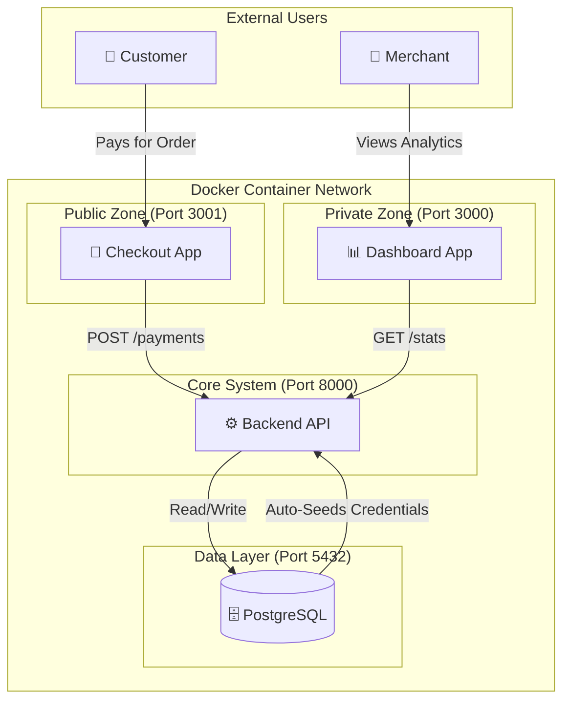
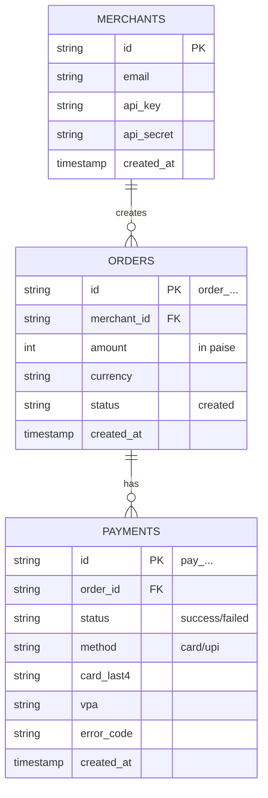

# 💳 Payment Gateway Simulator

A production-ready, containerized Payment Gateway Simulator built for the Capstone Project. This system simulates a real-world payment ecosystem, including a Merchant Dashboard, a Customer Checkout Page, and a robust Backend API with automated failure testing ("Magic Triggers").

---

## 🚀 Features

- **Full-Stack Simulation:** Complete flow from Order Creation → Checkout → Payment Processing → Merchant Analytics.
- **Dockerized Environment:** Entire stack (Frontend, Backend, Database) spins up with a single command.
- **Merchant Dashboard:** Real-time transaction history, success rate analytics, and credential management.
- **Universal Checkout:** Supports both Card (Luhn validation, Network detection) and UPI payment methods.
- **Simulation Engine:** Deterministic testing using specific inputs to force Success, Failure, or Pending states.
- **Auto-Seeding:** Database automatically initializes with test merchant credentials on startup.

---

## 🏗️ Architecture

The system follows a microservices-style architecture orchestrated via Docker Compose.



---

## 🛠️ Tech Stack

**Backend:** Node.js, Express.js
**Database:** PostgreSQL 15 (Alpine)
**Frontend (Dashboard):** React.js, Tailwind CSS, Recharts
**Frontend (Checkout):** React.js, Axios
**Infrastructure:** Docker, Docker Compose
**Testing:** Jest (Logic), Postman (API)

---

## ⚙️ Setup & Installation

### Prerequisites

Ensure Docker Desktop is installed and running.

### 1. Clone the Repository

```bash
git clone <your-repo-url>
cd payment-gateway
```

### 2. Configure Environment

Copy the example configuration file to create your local secrets.

```bash
cp .env.example .env
```

(No changes needed to `.env` for standard testing; defaults are set for Docker.)

### 3. Start the Application

```bash
docker-compose up -d --build
```

Wait ~10 seconds for the database to initialize and seed the test merchant.

---

## 🌐 Access the Services

| Service               | URL                                            | Credentials                              |
| --------------------- | ---------------------------------------------- | ---------------------------------------- |
| 🛍️ Checkout Page      | [http://localhost:3001](http://localhost:3001) | No login required                        |
| 📊 Merchant Dashboard | [http://localhost:3000](http://localhost:3000) | Email: `test@example.com` <br> Pass: Any |
| 🔌 Backend API        | [http://localhost:8000](http://localhost:8000) | `x-api-key: key_test_abc123`             |

---

## 🧪 Testing Guide (Magic Triggers)

The system uses specific input values to force deterministic outcomes for demonstration and grading.

### 💳 Card Payments

| Scenario         | Card Number                               | Result             |
| ---------------- | ----------------------------------------- | ------------------ |
| Success          | Ends with `4242` (e.g., 4242424242424242) | ✅ Success         |
| Bank Failure     | Ends with `0000` (e.g., 4242424242420000) | ❌ Failed          |
| Validation Error | Invalid Luhn or CVV length                | ⚠️ 400 Bad Request |

### 📱 UPI Payments

| Scenario     | VPA (UPI ID)                      | Result     |
| ------------ | --------------------------------- | ---------- |
| Success      | Any valid format (e.g., user@upi) | ✅ Success |
| Bank Failure | fail@bank                         | ❌ Failed  |

---

## 📚 API Documentation

**Base URL:** `http://localhost:8000/api/v1`

### 1. Health Check

```http
GET /health
```

**Response: 200 OK**

```json
{
  "status": "healthy",
  "database": "connected",
  "timestamp": "..."
}
```

### 2. Create Order

```http
POST /orders
```

**Headers:** `x-api-key`, `x-api-secret`

**Body**

```json
{
  "amount": 50000,
  "currency": "INR"
}
```

**Response:** `201 Created` → `{ "id": "order_..." }`

### 3. Process Payment

```http
POST /payments
```

**Body**

```json
{
  "order_id": "order_123...",
  "method": "card",
  "card": {
    "number": "4242...",
    "expiry_month": "12",
    "expiry_year": "2030",
    "cvv": "123"
  }
}
```

**Response:** `201 Created` – Payment status (`Processing → Success / Failed`)

---

## 🗄️ Database Schema

The database is automatically seeded with a test merchant on startup.



---

## 📂 Project Structure

```bash
payment-gateway/
├── backend/            # Express.js API & Database Logic
│   ├── src/controllers # Request Handlers
│   ├── src/config      # DB Connection & Init
│   └── src/routes      # API Routes
├── frontend/           # React Merchant Dashboard
│   └── src/            # Dashboard UI Components
├── checkout-page/      # React Customer Checkout
│   └── src             # Payment Forms & Logic
├── docs/               # Documentations and Images
│   ├── images/
│   │   ├── architecture.png
│   │   ├── db-schema.png
│   │   ├── dashboard.png
│   │   ├── checkout.png
│   │   ├── order-id-generation.png
│   │   ├── payment-status.png
│   │   └── transactions.png
│   ├── API_DOCUMENTATION.md
├── docker-compose.yml  # Container Orchestration
├── .env.example        # Environment Config Template
└── README.md           # Project Documentation
```
